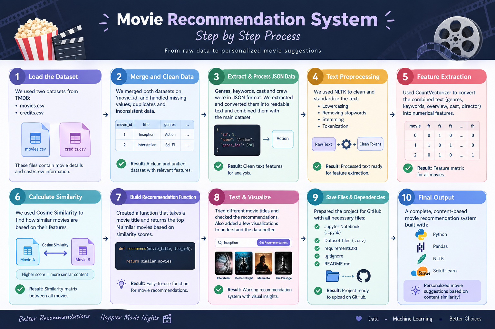

# 🎬 Movie Recommendation System

> A content-based movie recommendation system that recommends movies based on their similarity to a selected movie.

---

## 📌 Project Overview

Finding a movie to watch can be difficult when there are thousands of options available.

This project builds a **Movie Recommendation System** using Python and Machine Learning concepts to recommend movies that are similar to a movie selected by the user.

The system analyzes information such as:

* 🎭 Genres
* 🔑 Keywords
* 📝 Movie overview
* 🎬 Cast
* 🎥 Crew

These features are processed and combined into a single **tags** representation. The tags are then converted into numerical vectors using **CountVectorizer**, and **Cosine Similarity** is used to identify movies with similar content.

---

## 🖼️ Project Cover

```markdown

```

---

## 🎯 Objective

The main objective of this project is to build a recommendation system that can:

* Analyze movie metadata
* Identify similarities between movies
* Process textual movie information
* Convert movie information into numerical features
* Calculate similarity between movies
* Recommend movies similar to a selected movie

---

## 📊 Dataset

The project uses two CSV files:

### `movies.csv`

The movie dataset contains **4,803 records and 20 columns** before preprocessing.

Important columns include:

* `id`
* `title`
* `genres`
* `keywords`
* `overview`
* `original_language`
* `release_date`
* `popularity`
* `vote_average`
* `vote_count`

### `credits.csv`

The credits dataset contains **4,803 records and 4 columns**:

* `movie_id`
* `title`
* `cast`
* `crew`

The two datasets are merged using the movie ID.

After cleaning missing values, the working dataset contains **4,800 movies**.

---

## 🔄 Project Workflow

```text
Movies Dataset + Credits Dataset
                ↓
          Data Merging
                ↓
        Data Selection
                ↓
       Missing Value Handling
                ↓
       JSON Data Extraction
                ↓
      Feature Transformation
                ↓
        Create Movie Tags
                ↓
         Text Processing
                ↓
        CountVectorizer
                ↓
       Feature Vectors
                ↓
      Cosine Similarity
                ↓
       Similarity Matrix
                ↓
    Movie Recommendations
```

---

## 🧹 Data Preprocessing

The project begins by loading the movie and credits datasets using Pandas.

```python
import pandas as pd
import json

movies = pd.read_csv("movies.csv")
credits = pd.read_csv("credits.csv")
```

The datasets are then merged to bring movie information and credits together.

JSON-formatted columns such as `genres` and `keywords` are converted from strings into Python lists using `json.loads()`.

A custom function is used to extract the names from these JSON structures.

```python
def extract_values(str_lst):
    values = json.loads(str_lst)
    return [value["name"] for value in values]
```

Missing values are removed before continuing with feature engineering.

---

## 🏷️ Feature Engineering

The project works with the following important movie features:

* `overview`
* `genres`
* `keywords`
* `cast`
* `crew`

These features are processed to create a combined representation of each movie called **tags**.

The final dataframe used for recommendation contains:

```text
movie_id
title
tags
```

The resulting dataframe contains **4,800 movies**.

---

## 🔤 Text Vectorization

To compare movies mathematically, the text-based `tags` need to be converted into numerical vectors.

The project uses:

```python
from sklearn.feature_extraction.text import CountVectorizer

cv = CountVectorizer(
    max_features=5000,
    stop_words="english"
)
```

The vectorizer uses a maximum of **5,000 features** and removes common English stop words.

This transforms the movie tags into numerical feature vectors that can be compared.

---

## 📐 Cosine Similarity

After vectorization, **Cosine Similarity** is used to measure how similar movies are to each other.

```python
from sklearn.metrics.pairwise import cosine_similarity

similarity = cosine_similarity(vector)
```

The resulting similarity matrix has a shape of:

```text
(4800, 4800)
```

Each value represents the similarity between two movies.

A value closer to `1` indicates greater similarity, while a value closer to `0` indicates lower similarity.

---

## 🎬 Recommendation System

The recommendation process works by:

1. Taking a selected movie.
2. Finding its position in the dataset.
3. Comparing it with all other movies using the similarity matrix.
4. Sorting movies according to their similarity score.
5. Returning the most similar movies.

For example, selecting a movie such as **Avatar** can be used to find movies with similar characteristics based on their processed tags.

---

## 🛠️ Technologies Used

| Technology           | Purpose                                       |
| -------------------- | --------------------------------------------- |
| 🐍 Python            | Programming language                          |
| 🐼 Pandas            | Data loading and manipulation                 |
| 📦 JSON              | Processing structured movie metadata          |
| 🤖 Scikit-learn      | Text vectorization and similarity calculation |
| 🔢 CountVectorizer   | Converting movie tags into numerical vectors  |
| 📐 Cosine Similarity | Measuring movie similarity                    |
| 📓 Jupyter Notebook  | Development environment                       |

---

## 📁 Project Structure

```text
Movie-Recommendation-System/
│
├── Movie-Recommadation-System.ipynb
├── movies.csv
├── credits.csv
├── README.md
│
└── images/
    └── movie-recommendation-banner.png
```


## 🚀 How to Run

### 1. Clone the Repository

```bash
git clone https://github.com/muskanadnan07-svg/Movie-Recommendation-System.git
```

### 2. Open the Project

Navigate to the project directory:

```bash
cd Movie-Recommendation-System
```

### 3. Install Required Libraries

```bash
pip install pandas scikit-learn jupyter
```

### 4. Launch Jupyter Notebook

```bash
jupyter notebook
```

### 5. Open the Notebook

Open:

```text
Movie-Recommadation-System.ipynb
```

Make sure `movies.csv` and `credits.csv` are available in the same project directory.

---

## 💡 Key Learning Outcomes

Through this project, I practiced:

* Loading datasets using Pandas
* Exploring dataset dimensions and columns
* Merging multiple datasets
* Handling missing values
* Working with JSON-formatted data
* Extracting useful information from nested data
* Feature engineering
* Text preprocessing
* Using CountVectorizer
* Creating numerical feature representations
* Applying Cosine Similarity
* Building a content-based recommendation approach

---

## 🔮 Future Improvements

The project can be further improved by adding:

* 🌐 A web interface using Streamlit
* 🎞️ Movie posters and thumbnails
* ⭐ Movie ratings and popularity information
* 🔎 Search and autocomplete functionality
* 📊 Recommendation similarity scores
* 🎯 Personalized recommendations
* ⚡ Faster recommendation lookup
* ☁️ Deployment as a web application
* 🎨 A more interactive user interface


---

## ⚠️ Project Note

This project was developed as a **Machine Learning / Data Science learning project** to understand the fundamentals of recommendation systems, text vectorization, feature engineering, and similarity-based recommendations.

The current implementation is focused on the recommendation logic developed in the Jupyter Notebook.

---

## 👩‍💻 Author

**Muskan Adnan**

Aspiring **Data Scientist** passionate about Python, Machine Learning, Data Science, and building practical projects.

🔗 **GitHub:**
https://github.com/muskanadnan07-svg

🔗 **LinkedIn:**
https://www.linkedin.com/in/muskan-adnan/

---

## ⭐ If You Found This Project Interesting

Feel free to explore the project, experiment with the recommendation system, and build upon it.
